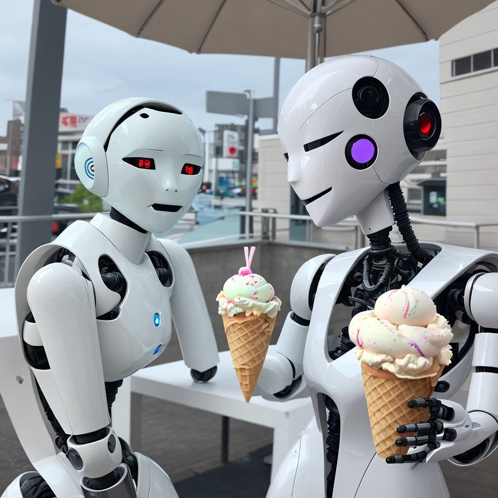
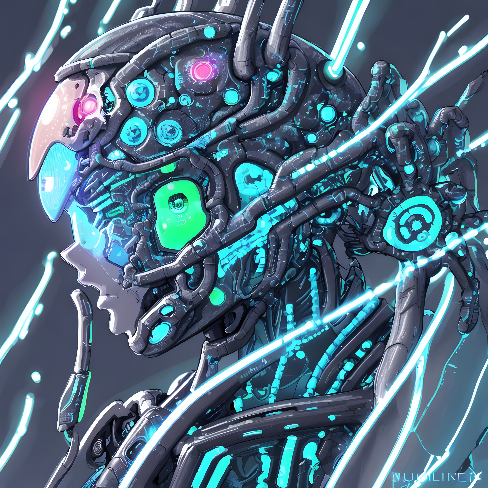

# Image Generation and Upscaling API Client

This project provides a Python script to interact with the GetImg.ai API for generating and upscaling images.

Documentation found here: https://docs.getimg.ai/

## Features

Generates images based on text prompts
Upscales generated images using the Real-ESRGAN-4x model
Stores images in `generated/` folder

## Prerequisites
Python 3.x
requests library
python-dotenv library
An API key from GetImg.ai

## Setup
Clone the repo, pip install dependencies and make a .env to store your API key in

## How to run
`python main.py`

## Example images

